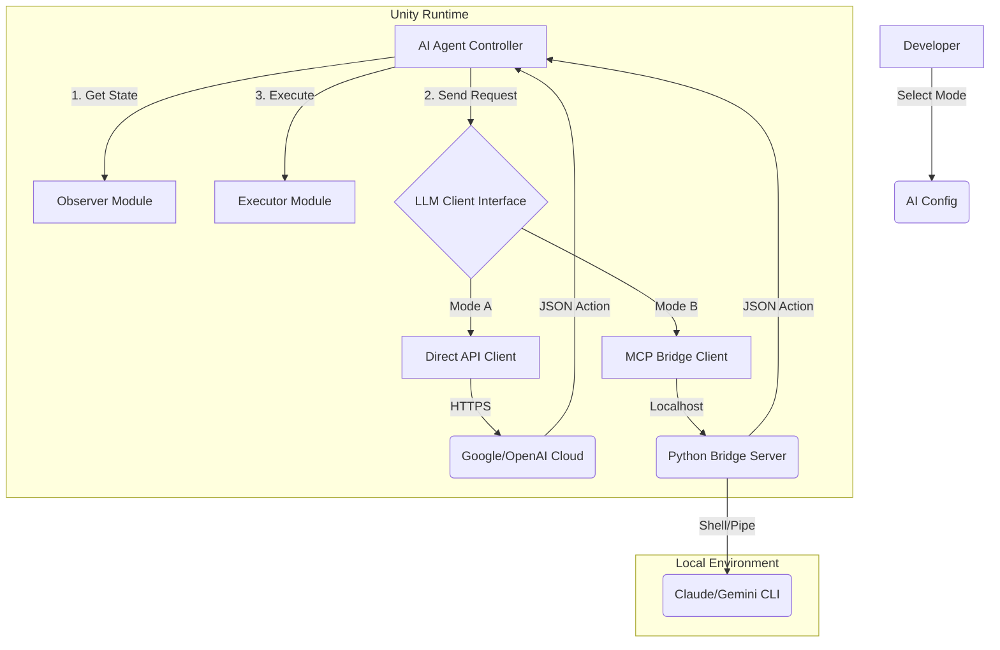

# System Architecture: AI Unity Tester (Hybrid Edition)

## 1. High-Level Overview

이 시스템은 **Dual-Mode Connectivity**를 지원하는 유니티 자율 테스트 에이전트입니다. 개발자는 상황에 따라 연결 방식을 즉시 교체할 수 있습니다.



## 2. Interface Design (Strategy Pattern)

핵심은 `ILLMClient` 인터페이스입니다. `AITesterAgent`는 현재 모드가 무엇인지 알 필요 없이 이 인터페이스만 호출합니다.

```csharp
public interface ILLMClient
{
    // 현재 화면과 컨텍스트를 보내고, 다음 행동(JSON)을 비동기로 받는다.
    UniTask<string> RequestActionAsync(Texture2D screenShot, string contextInfo);
}
```

### Implementations
1.  **`DirectAPIClient.cs`**:
    *   UnityWebRequest를 사용하여 Google Gemini/OpenAI API 엔드포인트로 직접 POST 요청.
    *   API Key는 `ScriptableObject`나 환경 변수에서 로드.

2.  **`MCPBridgeClient.cs`**:
    *   `http://localhost:8000/ask` 로 요청 전송.
    *   로컬 Python 서버가 이 요청을 받아 로컬 LLM이나 CLI 툴을 구동하고 결과를 반환.

## 3. Real-Time Handling: "Stop-and-Think"
(두 모드 모두 공통 적용)

1.  **Freeze:** `Time.timeScale = 0`.
2.  **Think:** `await client.RequestActionAsync(...)`.
3.  **Resume:** `Time.timeScale = 1`.
4.  **Act:** 입력 실행 및 결과 관찰 (Wait).

## 4. Directory Structure
```
Assets/
├── AIUnityTester/
│   ├── Scripts/
│   │   ├── Core/           # Main Agent, Config
│   │   ├── Modules/        # Observer, Executor
│   │   ├── Network/        # ILLMClient, DirectAPI, MCPBridge
│   │   └── Data/           # JSON Schemas
│   ├── Editor/             # Custom Inspectors
│   └── PythonBridge/       # (External) Local Python Server Script
```
