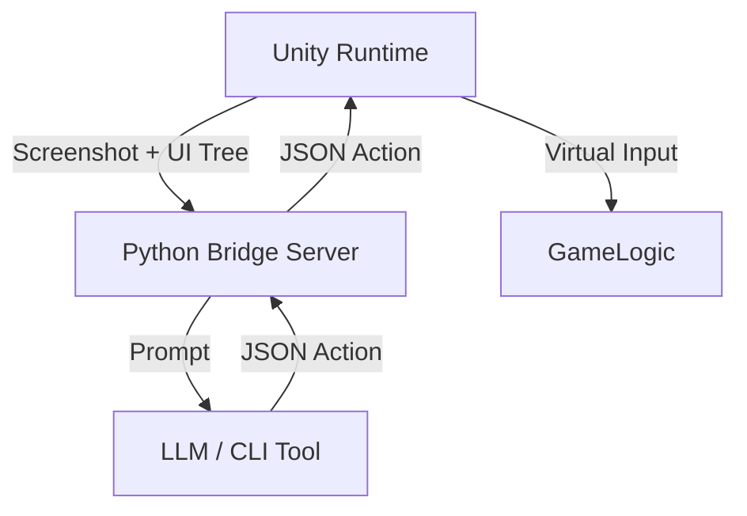

# AI Unity Game Tester 🎮🤖

**AI Unity Game Tester** is an autonomous QA agent that plays your Unity game using Multimodal LLMs (Gemini, GPT-4, Claude). It observes the game screen and UI hierarchy, plans actions ("Stop-and-Think"), and executes inputs (Click, Drag, Type) to test game mechanics or find bugs.

## ✨ Features

*   **Dual-Mode Brain**:
    *   **☁️ Direct API Mode**: Connects directly to Google Gemini / OpenAI APIs (High Performance).
    *   **🏠 MCP Bridge Mode**: Connects to local LLMs, Ollama, or CLI tools via a local Python server (Free/Unlimited).
*   **Stop-and-Think Strategy**: Pauses `Time.timeScale` to handle API latency, enabling testing of real-time action games.
*   **Context-Aware**: Analyzes both **Visuals** (Screenshot) and **Semantics** (UI Hierarchy Text) for accurate decision making.
*   **Integrated Control Panel**: One-click Python server setup and agent control directly within the Unity Editor.
*   **Virtual Input System**: Uses Unity's new Input System to simulate hardware-level mouse and keyboard events.

---

## 📦 Installation

### Prerequisites
1.  **Unity 2022.3 LTS** or higher.
2.  **Python 3.8+** installed and added to your system PATH.
3.  **New Input System** package enabled in Unity (`com.unity.inputsystem`).

### Option A: Copy to Project (Recommended)
1.  Download this repository (ZIP or Git Clone).
2.  Copy the `Assets/AIUnityTester` folder into your Unity project's `Assets` folder.

### Option B: Git Submodule
If you want to keep it updated:
```bash
cd YourUnityProject/Assets
git submodule add https://github.com/luidinkim/AIUnityGameTester.git AIUnityTester
```

---

## 🚀 Getting Started

### 1. Setup the Environment
1.  Open your Unity Project.
2.  Go to the top menu: **AI Tester > Control Panel**.
3.  In the **Python Bridge Server** section:
    *   Click **Install Requirements (pip)** to install `fastapi`, `uvicorn`, etc.
    *   Click **Start Server** (Green Button). You should see logs indicating the server is running at `127.0.0.1:8000`.

### 2. Prepare the Scene
1.  Create an empty GameObject in your scene and name it `AI_Agent`.
2.  Add the `AITesterAgent` component to it.
3.  (Optional) Configure settings in the Inspector:
    *   **Use MCP Bridge Mode**: Checked (Default) for local testing.
    *   **Action Delay**: Time to wait between actions.

### 3. Run the Test
1.  Press **Play** in the Unity Editor.
2.  In the **Control Panel** window, click **Find Agent in Scene**.
3.  Click **▶ Start AI Test**.
4.  Watch the AI take control! (The game will pause/resume automatically as the AI thinks).

---

## 📂 Architecture



*   **Core**: `AITesterAgent.cs` coordinates the loop.
*   **Eyes**: `UIHierarchyDumper.cs` extracts text info from Canvases.
*   **Hands**: `InputExecutor.cs` simulates clicks/keypresses.
*   **Bridge**: `server.py` (FastAPI) handles local communication.

## 🛠 Configuration

### Switching Modes
*   **Local / MCP Mode**: Uses the local Python server. Useful for debugging without API costs.
    *   Edit `Assets/AIUnityTester/PythonBridge/server.py` to connect to your specific local LLM or CLI tool.
*   **Cloud API Mode** (Coming Soon): Will connect directly to Gemini/OpenAI endpoints using API Keys.

## 📄 License
This project is licensed under the MIT License - see the LICENSE file for details.
